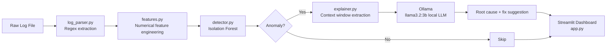

# 🔍 AI-Assisted Log Anomaly Detector

> Hybrid anomaly detection combining classical ML (Isolation Forest) with LLM-powered root cause analysis — built entirely on free, local tooling.


---

## The Problem

Logs are firehoses. A busy distributed system produces millions of lines per day — and the signal you care about (the one line that explains your outage) is buried inside all the noise. Traditional approaches like grep and regex are brittle and miss novel failure patterns. This project takes a hybrid approach:

1. **Isolation Forest** statistically detects lines whose feature combination is unlike the rest of the dataset — no labels, no training data needed.
2. **A local LLM (via Ollama)** reads the surrounding log context for each flagged anomaly and explains it in plain English: what happened, why it probably happened, and what an SRE should do next.

The result is a Streamlit dashboard where you can upload any HDFS-format log file and get actionable anomaly triage in under a minute, with zero API costs and zero data leaving your machine.

---

## Architecture



---

## Tech Stack

| Layer | Tool | Why |
|---|---|---|
| Log parsing | Python + `re` | Regex extraction of structured fields from raw HDFS log format |
| Feature engineering | `pandas` | Transforms text log fields into numerical vectors |
| Anomaly detection | `scikit-learn` IsolationForest | Unsupervised, no labelled data needed, industry-standard for AIOps |
| LLM inference | Ollama (`llama3.2:3b`) | Fully local, no API key, no rate limits, no cost, private |
| Visualization | Streamlit + Plotly | Fast interactive dashboards in pure Python |
| Data | [Loghub HDFS dataset](https://github.com/logpai/loghub) | Real-world benchmark used in AIOps research |

---

## Quickstart

### Prerequisites

- Python 3.10+
- [Ollama](https://ollama.com) installed and running

### 1. Clone the repo

```bash
git clone https://github.com/YOUR_USERNAME/log-anomaly-detector.git
cd log-anomaly-detector
```

### 2. Set up the Python environment

```bash
python3 -m venv venv
source venv/bin/activate        # Windows: venv\Scripts\activate
pip install -r requirements.txt
```

### 3. Pull the local LLM

```bash
ollama pull llama3.2:3b
```

This downloads a ~2GB model that runs on 8GB RAM. Ollama must be running in the background before you start the app.

### 4. Get the log data

Download `HDFS_2k.log` from [Loghub](https://github.com/logpai/loghub) and place it at:

### 5. Run the dashboard

```bash
streamlit run app.py
```

Open [localhost:8501](http://localhost:8501) in your browser.

---

## Project Structure

log-anomaly-detector/
├── data/
│   └── HDFS_2k.log          # Sample log dataset (download separately)
├── app.py                   # Streamlit dashboard + UI
├── parser.py                # Log line parser (regex → DataFrame)
├── features.py              # Feature engineering for Isolation Forest
├── detector.py              # Isolation Forest anomaly detection
├── explainer.py             # Ollama LLM context + explanation
├── requirements.txt
├── .gitignore
└── README.md

---

## How It Works

### Step 1: Parsing

`parser.py` uses a regex pattern to split each raw HDFS log line into structured fields: `date`, `time`, `pid`, `level`, `component`, and `message`. Output is a clean pandas DataFrame.

### Step 2: Feature Engineering

`features.py` converts text fields into numbers that Isolation Forest can work with:

| Feature | Logic | Intuition |
|---|---|---|
| `is_error` | 1 if level == ERROR, else 0 | Errors are inherently suspicious |
| `msg_length` | Character count of message | Stack traces produce unusually long messages |
| `component_frequency` | How often this component appears | Rare components deserve attention |
| `pid_normalized` | Z-score of process ID | Unusual PIDs may indicate rogue processes |

### Step 3: Isolation Forest

Isolation Forest works by randomly partitioning the data. Normal points take many splits to isolate. Anomalous points are isolated in very few splits. The `contamination` parameter tells the model what fraction of the data to treat as anomalous — default is 5%.

### Step 4: LLM Explanation

For each flagged anomaly, `explainer.py` builds a 20-line context window (10 lines before + 10 after), sends it to `llama3.2:3b` via Ollama, and asks the model to summarize the anomaly, suggest a probable root cause, and recommend a diagnostic command. Everything runs locally.

---

## Dashboard Features

- **Metric cards** — total lines, anomaly count, anomaly rate, error count
- **Distribution tab** — bar charts of log level distribution and anomalies per level
- **Components tab** — horizontal bar of top anomaly-producing components
- **Timeline tab** — rolling anomaly density chart across the log file
- **Anomaly table** — full sortable table of all flagged entries
- **AI explanations** — per-anomaly expandable panel with log context + LLM analysis
- **Sidebar controls** — sensitivity slider (0.01–0.20) and explanation count limiter

---

## Configuration

| Parameter | Default | Description |
|---|---|---|
| `contamination` | `0.05` | Fraction of data expected to be anomalous |
| `n_estimators` | `100` | Number of trees in the Isolation Forest |
| `window` | `10` | Lines of context on each side of an anomaly sent to the LLM |
| `max_explanations` | `5` | Max AI explanations generated per run |
| Ollama model | `llama3.2:3b` | Swap to `phi4` or any Ollama model for better quality |

---

## Advantages

**Zero cost.** The entire stack runs on free tiers or local compute. Ollama has no rate limits and no API key. Total infrastructure cost: $0.00.

**Privacy-first.** Your log data never leaves your machine. Unlike cloud-based AIOps tools, LLM inference runs fully locally. Viable for sensitive or regulated environments.

**No labelled training data needed.** Isolation Forest is unsupervised — it learns the normal distribution from the data itself and flags deviations.

**Explainability.** Most anomaly detection tools tell you *that* something is wrong. This one tells you *why* — and what to do next.

**Hybrid approach reflects real AIOps.** The combination of classical ML for detection and LLM for explanation mirrors how production AIOps tools (Dynatrace, Splunk ITSI, Moogsoft) actually work in 2026.

**Model-agnostic.** The Ollama layer is swappable. Point it at `phi4`, `mistral`, or any other local model with one config change.

---

## Limitations & Drawbacks

**Feature engineering is hand-crafted and brittle.** The four features were designed specifically for HDFS log format. A different log format — nginx, Kubernetes, syslog — would require rewriting `features.py` from scratch. A production system would use a learned log parser (Drain, Spell) or embedding-based features.

**Isolation Forest doesn't understand log semantics.** It works purely on numerical features. A line signalling an imminent failure might not be flagged if its feature vector looks statistically normal.

**The LLM context window is limited.** If the root cause is 500 lines earlier in the file, the 20-line window won't capture it. Production systems need smarter context retrieval — possibly embedding-based search over the full log file.

**`llama3.2:3b` is a small model.** It's fast and runs on low RAM, but it can hallucinate diagnostic commands or produce generic explanations. A larger model (`phi4`, `llama3.1:70b` via Groq) produces noticeably better analysis.

**No real-time / streaming support.** This is a batch tool — upload a file, analyze it. Adapting it for real-time use would require a streaming ingestion layer (Kafka, Filebeat) and a stateful anomaly detector.

**`contamination` is a guess.** Setting it to `0.05` assumes 5% of logs are anomalous. If your system's actual anomaly rate is different, you'll get false positives or missed detections. Tuning correctly requires domain knowledge or a labelled validation set.

**Streamlit reruns on every interaction.** It's not production-grade — every slider move re-parses the entire dataset. A real internal tool would decouple the backend (FastAPI) from the frontend.

---

## What I Learned

- Isolation Forest is genuinely useful for log anomaly detection — fast, unsupervised, and the contamination parameter gives intuitive sensitivity control.
- Feature engineering is the hardest part. Detection quality depends almost entirely on how well domain knowledge is encoded into numerical features.
- LLMs are better at *explaining* anomalies than *detecting* them. Classical ML handles detection; natural language handles explanation.
- Ollama makes local LLM inference trivially easy — a zero-cost, private AI backend changes what's feasible in a personal project.
- The gap between "it works" and "the README explains why it works" is where most portfolio projects fail.

---

## Roadmap

- [ ] RAG layer: ingest runbook `.md` files, retrieve relevant sections per anomaly
- [ ] Support additional log formats: nginx, Kubernetes events, Linux syslog
- [ ] Streaming mode: tail a live log file and detect anomalies in real time
- [ ] Learned log parsing with Drain3 instead of hand-written regex
- [ ] Export anomaly report as PDF or CSV
- [ ] Docker Compose setup for one-command deployment

---

## References

- [Loghub: A Large Collection of System Log Datasets](https://github.com/logpai/loghub) — He et al., 2020
- [Isolation Forest — scikit-learn docs](https://scikit-learn.org/stable/modules/generated/sklearn.ensemble.IsolationForest.html)
- [Ollama](https://ollama.com)
- [Streamlit](https://streamlit.io)

---

## License

MIT — do whatever you want with it. Attribution appreciated but not required.

---

<div align="center">
  <sub>Week 1, Project 2 — DevOps + AI Portfolio Series · Built with $0, runs on $0</sub>
</div>
